## EAGLE x MLA Attention: Layer-Level Overview

- **Goal**: Explain how EAGLE’s speculative decoding cycles interface with the MLA attention backend at the layer level (inputs/outputs during plan/run).
- **Params**: `speculative_algorithm="EAGLE"`, `speculative_num_steps=3`, `speculative_eagle_topk=1`, `speculative_num_draft_tokens=4`  
  - With `speculative_eagle_topk=1`, `speculative_num_draft_tokens` auto-aligns to `speculative_num_steps + 1 = 4`.

### High-level flow

EAGLE speculative decoding operates in cycles with three main phases:

1. **Draft-extend**: One prefill step where the draft model generates the first speculative token using the target model's hidden states.
2. **Multi-step draft**: `speculative_num_steps - 1` autoregressive decode steps where the draft model generates additional speculative tokens, building a tree of candidates.
3. **Target-verify**: One prefill step where the target model verifies all draft tokens in parallel and accepts/rejects them based on its own predictions.

**Key Insight**: The draft model generates tokens sequentially (depth-first), while the target model verifies them in parallel (breadth-first).

### Flowchart


### EAGLE Parameter Definitions

The following parameters control EAGLE speculative decoding behavior:

- **`speculative_algorithm`**: Specifies the speculative decoding algorithm. Set to `"EAGLE"` for EAGLE-2 or `"EAGLE3"` for EAGLE-3.
- **`speculative_draft_model_path`**: **Required**. Path to the draft model that generates speculative tokens.
- **`speculative_num_steps`**: Depth of autoregressive drafting. Controls how many tokens the draft model generates per cycle. Higher values increase speculation range but risk rejection cascades. Default is 5.
- **`speculative_eagle_topk`**: Branching factor per step. Controls how many candidate tokens are considered at each drafting step. Higher values improve candidate diversity and acceptance rate but increase memory/compute consumption. Default is 4.
- **`speculative_num_draft_tokens`**: Maximum parallel verification capacity. Controls how many draft tokens the target model can verify simultaneously. Higher values allow deeper tree evaluation but increase GPU memory usage. Default is 8.
- **`speculative_token_map`**: Optional path to frequency-ranked token mapping for FR-Spec optimization (e.g., `thunlp/LLaMA3-Instruct-8B-FR-Spec/freq_32768.pt`).

**Auto-adjustment**: When `speculative_eagle_topk=1`, the system automatically sets `speculative_num_draft_tokens = speculative_num_steps + 1` to ensure all generated tokens can be verified.

### Parameter Relationships and Trade-offs

**Core Relationship**: `speculative_num_draft_tokens` ≥ `speculative_num_steps * speculative_eagle_topk`

- **`speculative_num_steps`**: Controls **generation depth** - how many autoregressive steps the draft model performs
- **`speculative_eagle_topk`**: Controls **branching width** - how many candidates per step
- **`speculative_num_draft_tokens`**: Controls **verification capacity** - how many tokens can be verified in parallel

**Memory vs Performance Trade-offs**:
- **Higher `speculative_num_steps`**: More speculative tokens, higher acceptance potential, but more computation
- **Higher `speculative_eagle_topk`**: Better candidate diversity, higher acceptance rate, but exponential memory growth
- **Higher `speculative_num_draft_tokens`**: Larger verification window, better parallelization, but more GPU memory

**Optimal Configuration**: Balance these parameters based on your hardware constraints and performance requirements.

### EAGLE ↔ FlashInfer Backend Interaction

This section illustrates how the EAGLE speculative decoding backend interfaces with the FlashInfer MLA attention backend, focusing on the data flow and API calls between the two systems.

#### Backend Interface Overview


#### Detailed Interaction Flow


#### API Call Sequence

```mermaid
sequenceDiagram
    participant E as EAGLE Engine
    participant EI as EagleInput
    participant F as FlashInfer
    participant A as Attention Layer
    
    Note over E,A: Draft Extend Phase
    E->>EI: Create EagleDraftInput
    EI->>F: generate_attn_arg_prefill()
    F->>F: init_forward_metadata()
    F->>F: call_begin_forward()
    F->>A: plan() - generate indices
    A->>F: run() - attention computation
    F->>E: attention output
    
    Note over E,A: Multi-step Draft Phase
    loop N = speculative_num_steps - 1
        E->>EI: select_top_k → input_ids
        EI->>F: generate_attn_arg_decode()
        F->>A: plan() - decode indices
        A->>F: run() - decode attention
        F->>E: logits, hidden_states
    end
    
    Note over E,A: Target Verify Phase
    E->>EI: Create EagleVerifyInput
    EI->>F: generate_attn_arg_prefill()
    F->>A: plan() - verify indices
    A->>F: run() - verify attention
    F->>E: verification logits
    E->>E: Accept/reject tokens
```



#### Backend Interface Details

**EAGLE Backend Responsibilities:**
- **Speculative Engine**: Orchestrates draft-extend and target-verify cycles
- **Input Generation**: Creates `EagleDraftInput` and `EagleVerifyInput` objects
- **Token Tree Management**: Builds and manages the speculative token tree
- **Acceptance Logic**: Determines which draft tokens to accept

**FlashInfer Backend Responsibilities:**
- **Attention Computation**: Performs the actual attention calculations
- **Memory Management**: Handles KV cache and attention indices
- **Mode Switching**: Supports prefill and decode modes
- **Performance Optimization**: Optimized CUDA kernels for attention

**Data Flow Interface:**
- **EAGLE → FlashInfer**: Attention indices and metadata
- **FlashInfer → EAGLE**: Attention outputs and hidden states
- **Processing Modes**: Different attention modes for draft vs verify
- **API Contracts**: Well-defined interfaces between the two backends

#### Code Integration Points

```python
# EAGLE generates attention arguments
draft_input = EagleDraftInput(...)
draft_args = draft_input.generate_attn_arg_prefill()

# FlashInfer processes the attention
mla_backend = FlashInferMLABackend(...)
mla_backend.init_forward_metadata(draft_args)
mla_backend.call_begin_forward(draft_args)
attention_output = mla_backend.run(...)

# EAGLE processes the results
draft_tokens = process_attention_output(attention_output)
```

This architecture allows EAGLE to focus on speculative decoding logic while leveraging FlashInfer's optimized attention implementation for the core computations.

### EagleVerifyInput vs EagleDraftInput: Detailed Comparison

This section explains the key differences between `EagleVerifyInput` and `EagleDraftInput` classes, which serve different purposes in the EAGLE speculative decoding pipeline.

#### Class Purposes

**EagleDraftInput**: Used for **draft token generation** (extending the sequence with speculative tokens)
**EagleVerifyInput**: Used for **verification** (checking if draft tokens match target model predictions)

#### Structure Comparison

```python
# EagleDraftInput - For Draft Generation
@dataclass
class EagleDraftInput:
    # Decode inputs (for multi-step drafting)
    topk_p: torch.Tensor          # shape: (b, topk) - probabilities
    topk_index: torch.Tensor      # shape: (b, topk) - token indices
    hidden_states: torch.Tensor   # shape: (b, hidden_size) - model states
    
    # Extend inputs (for draft-extend phase)
    verified_id: torch.Tensor     # shape: (b,) - previously accepted tokens
    accept_length: torch.Tensor   # shape: (b,) - number of accepted tokens
    accept_length_cpu: List[int]  # CPU version for efficiency
    
    # Attention backend inputs
    kv_indptr: torch.Tensor       # shape: (b+1,) - KV cache pointers
    kv_indices: torch.Tensor      # shape: (total_kv,) - KV cache indices
    
    # Draft extend specific
    seq_lens_for_draft_extend: torch.Tensor
    req_pool_indices_for_draft_extend: torch.Tensor

# EagleVerifyInput - For Verification
@dataclass
class EagleVerifyInput:
    # Tree structure for verification
    draft_token: torch.Tensor     # shape: (total_draft_tokens,) - all draft tokens
    custom_mask: torch.Tensor     # shape: (total_draft_tokens,) - attention mask
    positions: torch.Tensor       # shape: (total_draft_tokens,) - token positions
    
    # Tree traversal indices
    retrive_index: torch.Tensor   # shape: (b, draft_token_num) - request indices
    retrive_next_token: torch.Tensor  # shape: (b, draft_token_num) - next token ptrs
    retrive_next_sibling: torch.Tensor # shape: (b, draft_token_num) - sibling ptrs
    retrive_cum_len: torch.Tensor # shape: (b,) - cumulative lengths
    
    # Configuration
    spec_steps: int               # Number of speculative steps
    topk: int                     # Top-k for sampling
    draft_token_num: int          # Total draft tokens per request
    capture_hidden_mode: CaptureHiddenMode
    seq_lens_sum: int             # Sum of sequence lengths
    seq_lens_cpu: torch.Tensor    # CPU sequence lengths
```

#### Concrete Examples

**Example 1: Draft Extend Phase (EagleDraftInput)**

```python
# Configuration: batch_size=2, spec_steps=3, topk=1
# Current state: Request 0 has 10 tokens, Request 1 has 8 tokens

eagle_draft_input = EagleDraftInput(
    # From previous verification
    verified_id=torch.tensor([42, 17]),           # Last accepted tokens
    accept_length=torch.tensor([10, 8]),          # Current sequence lengths
    accept_length_cpu=[10, 8],
    
    # Hidden states from previous forward pass
    hidden_states=torch.randn(2, 4096),           # (batch_size, hidden_size)
    
    # Top-k sampling results (from draft model)
    topk_p=torch.tensor([[0.8], [0.6]]),          # (batch_size, topk)
    topk_index=torch.tensor([[123], [456]]),      # (batch_size, topk)
    
    # Attention indices for FlashInfer
    kv_indptr=torch.tensor([0, 10, 18]),          # (batch_size+1,)
    kv_indices=torch.arange(18),                  # (total_kv_tokens,)
    
    # For next draft extend
    seq_lens_for_draft_extend=torch.tensor([11, 9]),  # accept_length + 1
    req_pool_indices_for_draft_extend=torch.tensor([0, 1])
)

# generate_attn_arg_prefill() output:
# qo_indptr = [0, 1, 2]  # One token per request for draft extend
# kv_indptr = [0, 10, 18]  # Based on current sequence lengths
# kv_indices = [0,1,2,...,17]  # All existing KV cache indices
```

**Example 2: Target Verify Phase (EagleVerifyInput)**

```python
# After multi-step drafting, we have a tree of draft tokens
# Request 0: [42, 123, 234, 345] (4 tokens including verified)
# Request 1: [17, 456, 567] (3 tokens including verified)

eagle_verify_input = EagleVerifyInput(
    # All draft tokens flattened
    draft_token=torch.tensor([42, 123, 234, 345, 17, 456, 567]),
    
    # Custom attention mask for tree structure
    custom_mask=torch.tensor([True, True, True, True, True, True, True]),
    
    # Token positions in the tree
    positions=torch.tensor([0, 1, 2, 3, 0, 1, 2]),
    
    # Tree traversal indices
    retrive_index=torch.tensor([[0, 1, 2, 3],     # Request 0: all 4 tokens
                               [4, 5, 6, -1]]),   # Request 1: 3 tokens, 1 empty
    retrive_next_token=torch.tensor([[1, 2, 3, -1],  # Next token pointers
                                    [5, 6, -1, -1]]),
    retrive_next_sibling=torch.tensor([[-1, -1, -1, -1],  # Sibling pointers
                                      [-1, -1, -1, -1]]),
    
    # Configuration
    spec_steps=3,
    topk=1,
    draft_token_num=4,  # spec_steps + 1
    capture_hidden_mode=CaptureHiddenMode.FULL,
    seq_lens_sum=7,     # Total tokens across all requests
    seq_lens_cpu=torch.tensor([4, 3])
)

# generate_attn_arg_prefill() output:
# qo_indptr = [0, 4, 7]  # Step by draft_token_num (4)
# kv_indptr = [0, 14, 21]  # Original seq_lens + draft_token_num
# kv_indices = [0,1,2,...,20]  # Extended KV cache indices
# custom_mask = [True, True, True, True, True, True, True]
```

#### Key Differences in generate_attn_arg_prefill()

```python
# EagleDraftInput.generate_attn_arg_prefill()
def generate_attn_arg_prefill(self, ...):
    bs = self.accept_length.numel()
    # qo_indptr: one token per request (draft extend generates 1 token)
    qo_indptr = torch.zeros((bs + 1,), dtype=torch.int32, device="cuda")
    qo_indptr[1:] = torch.cumsum(self.accept_length, dim=0)  # Based on accept_length
    
    # kv_indptr: based on current sequence lengths
    kv_indptr = torch.zeros((bs + 1,), dtype=torch.int32, device=paged_kernel_lens.device)
    kv_indptr[1:] = torch.cumsum(num_pages_per_req, dim=0)
    
    return kv_indices, kv_indptr, qo_indptr, None  # No custom mask

# EagleVerifyInput.generate_attn_arg_prefill()
def generate_attn_arg_prefill(self, ...):
    batch_size = len(req_pool_indices)
    # qo_indptr: step by draft_token_num (verify processes all draft tokens)
    qo_indptr = torch.arange(
        0, (1 + batch_size) * self.draft_token_num, 
        step=self.draft_token_num, dtype=torch.int32, device="cuda"
    )
    
    # kv_indptr: extended by draft_token_num
    paged_kernel_lens = paged_kernel_lens + self.draft_token_num
    cum_kv_seq_len[1:] = torch.cumsum(paged_kernel_lens, dim=0)
    
    return kv_indices, cum_kv_seq_len, qo_indptr, self.custom_mask  # Includes custom mask
```

#### Processing Flow Comparison

```mermaid
flowchart TD
    subgraph DRAFT["🟡 Draft Phase (EagleDraftInput)"]
        A[Start with verified_id, accept_length]
        B[Generate 1 draft token per request]
        C[Update accept_length += 1]
        D[Store hidden_states for next step]
    end
    
    subgraph VERIFY["🔵 Verify Phase (EagleVerifyInput)"]
        E[Collect all draft tokens in tree]
        F[Process entire draft window]
        G[Compare with target model]
        H[Accept/reject tokens]
        I[Update verified_id, accept_length]
    end
    
    A --> B --> C --> D
    D --> E --> F --> G --> H --> I
    I --> A
    
    classDef draftClass fill:#fef3c7,stroke:#f59e0b,stroke-width:2px
    classDef verifyClass fill:#dbeafe,stroke:#3b82f6,stroke-width:2px
    
    class A,B,C,D draftClass
    class E,F,G,H,I verifyClass
```



#### Summary

| Aspect | EagleDraftInput | EagleVerifyInput |
|--------|-----------------|------------------|
| **Purpose** | Generate draft tokens | Verify draft tokens |
| **Tokens per request** | 1 (draft extend) | draft_token_num (full window) |
| **qo_indptr pattern** | Based on accept_length | Step by draft_token_num |
| **Custom mask** | None | Tree structure mask |
| **Tree structure** | Linear (1 token) | Full tree (multiple tokens) |
| **Output** | Hidden states, topk results | Accept/reject decisions |
| **Next phase** | Multi-step draft or verify | Next draft extend cycle |

### Multi-Step Draft Phase: input_ids Shape Evolution

This section explains how the `input_ids` tensor shape changes during the multi-step draft phase when `speculative_num_steps=4`. The multi-step draft phase consists of **3 decode steps** (since we get 1 token from draft-extend and 3 more from multi-step draft).

#### Overview of the Multi-Step Draft Process


#### Input from forward_extend (Draft Extend Phase)

The multi-step draft phase receives its initial input from the **draft-extend phase**, which itself gets input from the **target-extend phase**:

**Target Extend Phase** (`forward_target_extend`):
```python
# Target model generates next tokens and hidden states
logits_output, next_token_ids, bid, seq_lens_cpu = self.forward_target_extend(batch)
# next_token_ids: shape (batch_size,) - newly generated tokens
# logits_output.hidden_states: shape (batch_size, hidden_size) - full hidden states
```

**Draft Extend Phase** (`forward_draft_extend`):
```python
# Draft model uses target model's hidden states and next tokens
self.forward_draft_extend(
    batch, 
    logits_output.hidden_states,  # From target model
    next_token_ids,               # From target model
    seq_lens_cpu
)

# Creates EagleDraftInput with:
batch.spec_info = EagleDraftInput(
    hidden_states=hidden_states,  # From target model
    verified_id=next_token_ids,   # From target model
    num_tokens_per_batch=1,
    num_tokens_for_logprob_per_batch=1,
)

# Draft model forward generates:
logits_output = draft_model.forward(forward_batch)
# Results in:
# - topk_p: shape (batch_size, topk) - probabilities
# - topk_index: shape (batch_size, topk) - token indices
# - hidden_states: shape (batch_size, hidden_size) - draft model states
```

#### Where forward_decode is Replaced

In EAGLE, the standard `forward_decode` is **completely replaced** by the speculative decoding pipeline:

**Standard Decode Flow** (replaced):
```python
# Standard decode (NOT used in EAGLE)
def standard_decode(batch):
    batch.prepare_for_decode()  # Sets forward_mode = ForwardMode.DECODE
    model_worker_batch = batch.get_model_worker_batch()
    forward_batch = ForwardBatch.init_new(model_worker_batch, model_runner)
    logits_output, _ = model_runner.forward(forward_batch)  # Calls forward_decode
    next_token_ids = model_runner.sample(logits_output, forward_batch)
    return next_token_ids
```

**EAGLE Decode Flow** (replacement):
```python
# EAGLE speculative decode (replaces standard decode)
def eagle_decode(batch):
    if batch.forward_mode.is_extend():
        # Draft-extend phase
        logits_output, next_token_ids, bid, seq_lens_cpu = self.forward_target_extend(batch)
        self.forward_draft_extend(batch, logits_output.hidden_states, next_token_ids, seq_lens_cpu)
        return logits_output, next_token_ids, bid, 0, False
    else:
        # Multi-step draft + verify phase
        spec_info = self.draft(batch)  # Multi-step draft
        logits_output, verify_output, model_worker_batch, can_run_cuda_graph = self.verify(batch, spec_info)
        self.forward_draft_extend_after_decode(batch)  # Prepare for next cycle
        return logits_output, verify_output.verified_id, model_worker_batch.bid, sum(verify_output.accept_length_per_req_cpu), can_run_cuda_graph
```

**Key Replacement Points**:
1. **`forward_batch_generation`**: EAGLE overrides this method to use `forward_batch_speculative_generation`
2. **`forward_decode`**: Never called in EAGLE; replaced by `draft_forward` + `verify`
3. **`prepare_for_decode`**: Modified to skip standard decode preparation when EAGLE is enabled

#### Detailed Shape Changes with Examples

**Configuration**: `batch_size=2`, `speculative_num_steps=4`, `speculative_eagle_topk=1`

**Initial State** (after draft-extend):
```python
# From draft-extend phase (input from forward_extend)
topk_p = torch.tensor([[0.8], [0.6]])           # shape: (2, 1) - from draft model
topk_index = torch.tensor([[123], [456]])       # shape: (2, 1) - from draft model
hidden_states = torch.randn(2, 4096)            # shape: (2, hidden_size) - from draft model
scores = None                                   # Initial state for multi-step draft
```

**Step 0 (i=0) - First Multi-step Draft**:
```python
# select_top_k_tokens(i=0, ...)
if i == 0:
    input_ids = topk_index.flatten()            # shape: (2,) → [123, 456]
    hidden_states = hidden_states.repeat_interleave(speculative_eagle_topk, dim=0)  # shape: (2, 4096)
    scores = topk_p                             # shape: (2, 1)

# Forward pass with input_ids = [123, 456]
# Model generates logits for next tokens
logits_output = model.forward(input_ids=[123, 456])
probs = torch.softmax(logits_output.next_token_logits, dim=-1)  # shape: (2, vocab_size)
topk_p, topk_index = fast_topk(probs, topk=speculative_eagle_topk, dim=-1)          # shape: (2, 1)
# Example: topk_p = [[0.7], [0.5]], topk_index = [[234], [567]]
```

**Step 1 (i=1) - Second Multi-step Draft**:
```python
# select_top_k_tokens(i=1, ...)
else:  # i > 0
    # Expand scores: (batch_size, topk, 1) × (batch_size, topk, topk)
    expand_scores = torch.mul(
        scores.unsqueeze(2),                    # shape: (2, 1, 1)
        topk_p.reshape(-1, topk, topk)          # shape: (2, 1, 1)
    )  # shape: (2, 1, 1)
    
    # Select top-k from expanded scores
    topk_cs_p, topk_cs_index = fast_topk(
        expand_scores.flatten(start_dim=1), topk=1, dim=-1
    )  # shape: (2, 1)
    
    # Gather input_ids from previous topk_index
    topk_index = topk_index.reshape(-1, topk**2)  # shape: (2, 1)
    input_ids = torch.gather(topk_index, index=topk_cs_index, dim=1).flatten()
    # input_ids = [234, 567]  # shape: (2,)

# Forward pass with input_ids = [234, 567]
logits_output = model.forward(input_ids=[234, 567])
probs = torch.softmax(logits_output.next_token_logits, dim=-1)
topk_p, topk_index = fast_topk(probs, topk=1, dim=-1)
# Example: topk_p = [[0.6], [0.4]], topk_index = [[345], [678]]
```

**Step 2 (i=2) - Third Multi-step Draft**:
```python
# select_top_k_tokens(i=2, ...)
# Similar to Step 1, but with updated scores and topk_index
expand_scores = torch.mul(scores.unsqueeze(2), topk_p.reshape(-1, topk, topk))
topk_cs_p, topk_cs_index = fast_topk(expand_scores.flatten(start_dim=1), topk=1, dim=-1)
input_ids = torch.gather(topk_index, index=topk_cs_index, dim=1).flatten()
# input_ids = [345, 678]  # shape: (2,)

# Forward pass with input_ids = [345, 678]
logits_output = model.forward(input_ids=[345, 678])
probs = torch.softmax(logits_output.next_token_logits, dim=-1)
topk_p, topk_index = fast_topk(probs, topk=1, dim=-1)
# Example: topk_p = [[0.5], [0.3]], topk_index = [[456], [789]]
```

#### Complete Draft Tree Construction

After all 4 steps (1 draft-extend + 3 multi-step draft), the complete draft tree is built:

```python
# Final draft tokens for each request
draft_tokens = {
    "Request 0": [42, 123, 234, 345],  # 4 tokens (verified + 3 draft)
    "Request 1": [17, 456, 567, 678]   # 4 tokens (verified + 3 draft)
}

# Flattened for EagleVerifyInput
draft_token = torch.tensor([42, 123, 234, 345, 17, 456, 567, 678])  # shape: (8,)

# Tree structure indices
retrive_index = torch.tensor([
    [0, 1, 2, 3],  # Request 0: all 4 tokens
    [4, 5, 6, 7]   # Request 1: all 4 tokens
])  # shape: (2, 4)
```

#### Key Insights

**1. Input Flow**:
- **Target Extend**: Generates `hidden_states` and `next_token_ids`
- **Draft Extend**: Uses target's output to generate `topk_p` and `topk_index`
- **Multi-step Draft**: Uses draft's output to build the complete tree

**2. Consistent input_ids Shape**:
- Each decode step processes `input_ids` with shape `(batch_size * topk,)`
- For `topk=1`: shape is always `(batch_size,)`
- For `topk>1`: shape is always `(batch_size * topk,)`

**3. Token Selection Logic**:
- **Step 0**: Direct selection from draft-extend results
- **Steps 1+**: Selection based on accumulated scores and previous top-k indices

**4. Tree Building**:
- Each step adds one token per request to the draft tree
- The tree structure is maintained through `retrive_index`, `retrive_next_token`, etc.

**5. Attention Backend Usage**:
```python
# Each step uses a different attention backend
forward_batch.attn_backend = self.draft_attn_backend.attn_backends[i]
# where i ∈ [0, 1, 2] for the 3 multi-step draft steps
```

**6. forward_decode Replacement**:
- **Standard decode**: `forward_decode` → `model.forward` → sampling
- **EAGLE decode**: `draft_forward` → `verify` → `forward_draft_extend_after_decode`

#### Shape Summary Table

| Phase | Step | input_ids Shape | Description |
|-------|------|-----------------|-------------|
| Target Extend | - | `(batch_size,)` | Target model generates next tokens |
| Draft Extend | - | `(batch_size,)` | Draft model uses target's hidden states |
| Multi-step Draft | 0 | `(batch_size * topk,)` | First decode step |
| Multi-step Draft | 1 | `(batch_size * topk,)` | Second decode step |
| Multi-step Draft | 2 | `(batch_size * topk,)` | Third decode step |
| Target Verify | - | `(total_draft_tokens,)` | All draft tokens flattened |

This design ensures efficient parallel processing while maintaining the tree structure needed for speculative decoding verification, completely replacing the standard decode flow with a more sophisticated speculative pipeline.

### How total_draft_tokens is Computed

The `total_draft_tokens` represents the total number of draft tokens across all requests in a batch. It is computed as:

```python
total_draft_tokens = batch_size * speculative_num_draft_tokens
```

#### speculative_num_draft_tokens Calculation

The `speculative_num_draft_tokens` parameter is determined through the following process:

**1. Auto-Selection (Default)**:
```python
def auto_choose_speculative_params(self: ServerArgs):
    """Automatically choose parameters for speculative decoding."""
    hf_config = self.get_hf_config()
    arch = hf_config.architectures[0]
    
    if arch in ["LlamaForCausalLM"]:
        return (5, 4, 8)  # (speculative_num_steps, speculative_eagle_topk, speculative_num_draft_tokens)
    elif arch in ["DeepseekV3ForCausalLM", "DeepseekV2ForCausalLM"]:
        return (3, 1, 4)  # (speculative_num_steps, speculative_eagle_topk, speculative_num_draft_tokens)
    elif arch in ["Grok1ForCausalLM", "Grok1VForCausalLM"]:
        return (5, 4, 8)  # (speculative_num_steps, speculative_eagle_topk, speculative_num_draft_tokens)
    else:
        return (5, 4, 8)  # Default for all other models
```

**2. Auto-Adjustment for speculative_eagle_topk=1**:
```python
if (self.speculative_eagle_topk == 1 and 
    self.speculative_num_draft_tokens != self.speculative_num_steps + 1):
    logger.warning(
        "speculative_num_draft_tokens is adjusted to speculative_num_steps + 1 "
        "when speculative_eagle_topk == 1"
    )
    self.speculative_num_draft_tokens = self.speculative_num_steps + 1
```

**3. Manual Override**:
Users can manually set `speculative_num_draft_tokens` via CLI argument:
```bash
--speculative-num-draft-tokens 4
```

#### Example Calculations

**Example 1: Llama Model (Auto-selected)**:
```python
# Auto-selected parameters
speculative_num_steps = 5
speculative_eagle_topk = 4
speculative_num_draft_tokens = 8

# For batch_size = 2
total_draft_tokens = 2 * 8 = 16
```

**Example 2: Deepseek Model (Auto-selected)**:
```python
# Auto-selected parameters
speculative_num_steps = 3
speculative_eagle_topk = 1
speculative_num_draft_tokens = 4  # Auto-adjusted from 4 to 3+1=4

# For batch_size = 2
total_draft_tokens = 2 * 4 = 8
```

**Example 3: Manual Configuration**:
```python
# User-specified parameters
speculative_num_steps = 4
speculative_eagle_topk = 1
speculative_num_draft_tokens = 5  # Manually set

# For batch_size = 3
total_draft_tokens = 3 * 5 = 15
```

#### Key Insights

**1. Token Distribution**:
- **Draft Extend**: 1 token per request (from target model)
- **Multi-step Draft**: `speculative_num_steps - 1` tokens per request
- **Total per Request**: `speculative_num_draft_tokens` tokens

**2. Tree Structure**:
- Each request gets exactly `speculative_num_draft_tokens` tokens
- Tokens are arranged in a tree structure based on scores
- The tree allows for efficient verification and rejection

**3. Memory Allocation**:
```python
# KV cache allocation includes headroom for draft tokens
draft_runner_cache_size = (
    max_total_num_tokens
    # draft tokens
    + max_num_reqs * speculative_num_steps * speculative_eagle_topk
    # verify tokens  
    + max_num_reqs * speculative_num_draft_tokens
    # buffer
    + 100
)
```

**4. Shape Consistency**:
- `draft_token`: shape `(total_draft_tokens,)` - all draft tokens flattened
- `retrive_index`: shape `(batch_size, speculative_num_draft_tokens)` - tree indices
- `positions`: shape `(total_draft_tokens,)` - token positions in sequence

This computation ensures that the EAGLE system has sufficient tokens for speculative decoding while maintaining efficient memory usage and tree structure for verification.

### Difference Between speculative_num_steps and speculative_num_draft_tokens

These two parameters serve **fundamentally different purposes** in EAGLE speculative decoding:

#### speculative_num_steps: **Generation Depth (Draft Model)**

**Definition**: The number of **autoregressive steps** the draft model performs to generate tokens.

**Purpose**: Controls how **deep** the draft model goes when generating speculative tokens.

**What it controls**:
- **Draft Extend**: 1 token per request (from target model)
- **Multi-step Draft**: `speculative_num_steps - 1` tokens per request  
- **Total tokens generated**: `speculative_num_steps` tokens per request

**Usage in Code**:
```python
# In draft_forward() - controls the loop iterations
for i in range(self.speculative_num_steps):
    input_ids, hidden_states, scores, tree_info = select_top_k_tokens(
        i, topk_p, topk_index, hidden_states, scores, self.topk
    )
    # ... process step i
    
    # We don't need to run the last forward. we get 1 token from draft prefill 
    # and (#spec steps - 1) tokens here
    if i == self.speculative_num_steps - 1:
        break
```

#### speculative_num_draft_tokens: **Verification Capacity (Target Model)**

**Definition**: The **maximum number of draft tokens** that can be verified in parallel by the target model.

**Purpose**: Controls the **width** of the verification window - how many draft tokens the target model can evaluate simultaneously.

**What it controls**:
- Target model processes **up to** `speculative_num_draft_tokens` tokens in one forward pass
- If more tokens are generated than can be verified, excess tokens are discarded
- Verification is **parallel** - all tokens in the window are evaluated simultaneously

**Usage in Code**:
```python
# In EagleVerifyInput - sets verification capacity
return EagleVerifyInput(
    draft_token=draft_tokens,
    custom_mask=tree_mask,
    positions=position,
    retrive_index=retrive_index,
    retrive_next_token=retrive_next_token,
    retrive_next_sibling=retrive_next_sibling,
    retrive_cum_len=None,
    spec_steps=self.speculative_num_steps,
    topk=self.topk,
    draft_token_num=self.server_args.speculative_num_draft_tokens,  # ← Verification capacity
    capture_hidden_mode=CaptureHiddenMode.FULL,
    seq_lens_sum=forward_batch.seq_lens_sum,
    seq_lens_cpu=forward_batch.seq_lens_cpu,
)
```

#### Key Differences Summary

| Aspect | speculative_num_steps | speculative_num_draft_tokens |
|--------|----------------------|------------------------------|
| **Purpose** | Draft generation depth | Verification capacity |
| **Phase** | Draft phase | Verify phase |
| **Direction** | Forward (autoregressive) | Parallel (window-based) |
| **Model** | Draft model | Target model |
| **Control** | How many tokens to generate | How many tokens to verify |
| **Relationship** | Generation limit | Verification limit |

#### Practical Examples

**Example 1: Balanced Configuration (topk=1)**
```python
speculative_num_steps = 4        # Generate 4 tokens
speculative_eagle_topk = 1       # 1 candidate per step
speculative_num_draft_tokens = 4 # Verify 4 tokens
# Result: All generated tokens can be verified
# Auto-adjustment: num_draft_tokens = num_steps + 1 = 4 ✓
```

**Example 2: High Branching (topk>1)**
```python
speculative_num_steps = 3        # Generate 3 tokens
speculative_eagle_topk = 4       # 4 candidates per step
speculative_num_draft_tokens = 12 # Verify 12 tokens
# Result: All generated tokens can be verified
# Required: num_draft_tokens ≥ num_steps * topk = 3 * 4 = 12 ✓
```

**Example 3: Generation > Verification**
```python
speculative_num_steps = 6        # Generate 6 tokens  
speculative_eagle_topk = 2       # 2 candidates per step
speculative_num_draft_tokens = 8 # Verify 8 tokens
# Result: Only first 8 tokens are verified, last 4 are discarded
# Required: num_draft_tokens ≥ num_steps * topk = 6 * 2 = 12 (but only 8 available)
```

**Example 4: Verification > Generation**
```python
speculative_num_steps = 3        # Generate 3 tokens
speculative_eagle_topk = 1       # 1 candidate per step
speculative_num_draft_tokens = 5 # Verify 5 tokens  
# Result: All 3 tokens are verified, 2 verification slots unused
# Auto-adjustment: num_draft_tokens = num_steps + 1 = 4 (but manually set to 5)
```

#### Memory and Performance Implications

**Memory Usage**:
```python
# KV cache allocation
draft_runner_cache_size = (
    max_total_num_tokens
    # Draft tokens: based on generation steps
    + max_num_reqs * speculative_num_steps * speculative_eagle_topk
    # Verify tokens: based on verification capacity  
    + max_num_reqs * speculative_num_draft_tokens
    + 100
)
```

**Performance Trade-offs**:
- **Higher `speculative_num_steps`**: More speculative tokens, higher acceptance potential, but more computation
- **Higher `speculative_num_draft_tokens`**: Larger verification window, better parallelization, but more memory

#### Auto-Adjustment Logic

When `speculative_eagle_topk == 1`, the system automatically aligns these parameters:
```python
if (self.speculative_eagle_topk == 1 and 
    self.speculative_num_draft_tokens != self.speculative_num_steps + 1):
    # Auto-adjust to ensure all generated tokens can be verified
    self.speculative_num_draft_tokens = self.speculative_num_steps + 1
```

This ensures that when using `speculative_eagle_topk=1` (single token per step), the verification capacity matches the generation capacity, preventing token waste.

#### Best Practices

1. **For `speculative_eagle_topk=1`**: Let auto-adjustment handle the alignment
2. **For `speculative_eagle_topk>1`**: Set `speculative_num_draft_tokens` ≥ `speculative_num_steps * speculative_eagle_topk` to verify all generated tokens
3. **Memory-constrained**: Reduce `speculative_num_draft_tokens` to save memory
4. **Performance-optimized**: Increase both parameters for higher throughput (if memory allows)

This distinction is crucial for understanding EAGLE's performance characteristics and tuning the system for optimal results.

### Summary: How Parameters Control EAGLE Performance

**Generation Phase (Draft Model)**:
- `speculative_num_steps` controls how many tokens to generate per cycle
- `speculative_eagle_topk` controls how many candidates to explore per step
- Total possible tokens = `speculative_num_steps * speculative_eagle_topk`

**Verification Phase (Target Model)**:
- `speculative_num_draft_tokens` controls how many tokens can be verified in parallel
- Must be ≥ `speculative_num_steps * speculative_eagle_topk` to verify all generated tokens
- When `speculative_eagle_topk=1`, auto-adjusts to `speculative_num_steps + 1`

**Performance Optimization**:
- Higher `speculative_num_steps` → more speculative tokens → higher acceptance potential
- Higher `speculative_eagle_topk` → better candidate diversity → higher acceptance rate  
- Higher `speculative_num_draft_tokens` → larger verification window → better parallelization

**Memory Constraints**:
- `speculative_eagle_topk` has exponential memory impact due to tree branching
- `speculative_num_draft_tokens` directly affects GPU memory usage for verification
- Balance these parameters based on available hardware resources

### Attention layer interface

- **plan(...) (prefill, decode)**
  - **qo_indptr**:
    - Draft Extend: from EAGLE’s `accept_length`
    - Target Verify: `arange(0, (1+bs)*draft_token_num, step=draft_token_num)` → step 4
  - **kv_indptr, kv_indices**: from `req_pool_indices` and `req_to_token`
  - **kv_len_arr**:
    - Verify: base `seq_lens` plus `draft_token_num` (window length)
    - Draft Extend: base `seq_lens`
  - **causal**: True for prefill; False for draft decode

- **run(...)**
  - Inputs: `q_nope`, `q_rope`, `k_ckv`, `k_kpe`
  - Output: `o` (per-head v-dim), used to build logits/hidden_states

### Code references

- **Mode handling and MLA prefill for Draft Extend / Target Verify**:

```
python/sglang/srt/layers/attention/flashinfer_mla_backend.py (init_forward_metadata)
```

- **MLA prefill planning with EAGLE’s generated qo/kv**:

```
python/sglang/srt/layers/attention/flashinfer_mla_backend.py (call_begin_forward)
```

- **EAGLE verify: generate qo/kv for a window of size draft_token_num (4)**:

```
python/sglang/srt/speculative/eagle_utils.py (EagleVerifyInput.generate_attn_arg_prefill)
```

- **EAGLE draft-extend: qo_indptr from accept_length**:

```
python/sglang/srt/speculative/eagle_utils.py (EagleDraftInput.generate_attn_arg_prefill)
```

- **Auto-align `num_draft_tokens = steps + 1` for topk=1**:

```
python/sglang/srt/server_args.py
```

- **In your file** `test_llm.py` line 44:

```
speculative_algorithm="EAGLE"
```

